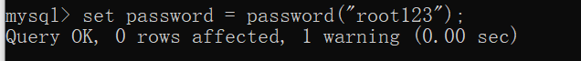

# 0 总结

- 文件格式

  


# 1 Flask

### 0.总结

1. **只有form和接收POST传输的数据的网址可以使用`method="POST"`，否则会报错**

1. **`GET`是看，`POST`是请求**

1. **可以使用占位符`{{占位符}}`，可以进行数据替换**

   - 通过python实现动态页面

   - 单个替换

       ```html
       <h1>
           {{占位符}}
       </h1>
       ```
       
       ```python
       return reder_template("index.html",占位符="哈哈")
       ```

   

   - 循环的占位符
     
       ```html
       
        内容
        {{item}}
       
       ```

1. **占位符示例见应用18**


### 1. 快速应用(`py`文件)

   ```python
   from flask import Flask
   
   app = Flask(__name__)  # 实例化了Flask类
   
   
   # 创建了网址 /show/info 和 index函数的对应关系
   # 以后进入网址，就会自动执行index函数
   @app.route("/show/info")
   def index():
       return "中国联通"
   
   # 表示只支持GET请求
   @app.route("/show/info"，methods=['GET'])
   
   # 表示只支持POST请求
   @app.route("/show/info"，methods=['POST'])
   ```

### 2. flask可读取文件中字符

会自动打开这个文件，并读取内容，将内容返回（默认去当前项目的templates文件夹中找）

   ```python
   from flask import Flask,render_template
   
   app = Flask(__name__)  # 实例化了Flask类
   
   
   # 创建了网址 /show/info 和 index函数的对应关系
   # 以后进入网址，就会自动执行index函数
   @app.route("/show/info")
   def index():
       # return "中国联通"
       # 会自动打开这个文件，并读取内容，将内容返回（默认去当前项目的templates文件夹中找）
       return render_template("index.html")
   
   if __name__ == '__main__':
       app.run()
   ```

### 3. flask可以接受发送的数据


- **只有form和接收POST传输的数据的网址可以使用`method="POST"`，否则会报错**

  

#### GET发送的请求

- 使用request.args

```python
from flask import Flask, render_template,request

app = Flask(__name__)

@app.route("/register",methods=['GET'])
def register():
   return render_template("register.html")

@app.route("/do/reg")
def do_reg():
   # 接收到数据
   print(request.args) # 这里打印数据
   # 返回数据
   return "注册成功"

if __name__ == '__main__':
   app.run()
```

#### POST发送的请求

- 使用request.form

```python
from flask import Flask, render_template, request

app = Flask(__name__)


@app.route("/register", methods=['POST'])
def register():
   return render_template("register.html")

@app.route("/post/reg", methods=['POST'])
def post_reg():
   # 接收到数据
   print(request.form)
   # 返回数据
   return "注册成功"

if __name__ == '__main__':
   app.run()

```

#### POST接收到的数据的分析

```python
def post_reg():
   # 接收到数据
   # 单个数据
   user=request.form.get("user")
   # 列表数据
   hobby_list = request.form.getlist("hobby")
   # 返回数据
   return "注册成功"
```

   #### 可以自己接受自己的数据输入

```python
@app.route("/register", methods=['GET', 'POST'])
def register():
    if request.methods == "GET":
        return render_template("register.html")
    else:
        print(request.form)

        user = request.form.get("user")
        pwd = request.form.get("pwd")
        gender = request.form.get("gender")
        hobby_list = request.form.getlist("hobby")
        city = request.form.get("city")
        skill_list = request.form.getlist("skill")
        more = request.form.get("more")

        print(user, pwd, gender, hobby_list, city, skill_list, more)

        return "POST方式 注册成功"
```


# 2 HTML

## 0.总结

### 1 标签

- 所有的标签都是可以嵌套的，要分辨标签是块级还是行级的

###  2 网站的进入

- 网站的进入会调用app的函数，实现对于html文件的调用，返回html文件让浏览器接受

### 3 网络请求

- GET请求：将数据体现在URL中

- POST请求：将数据隐藏，不体现在URL中，只能通过表单的提交请求提交

- 所有的数据的传输都要有`name`和`value`变量


## 1 信息的显示

### 1. `div `和` span` 

#### div

   `div`是一个内容占一整行，块级标签
```html
   <div>
       内容
   </div>
```

#### span

   `span`是自己多大就占多大，是行级标签，或内联标签，使得行内内容格式可以不同
   ```html
   <span> 内容 </span>
   ```

#### div和span的嵌套
```html
   <div>
       <span style="color:red"> </span>
       <span> </span>
   </div>
```

### 2. `title`(head部分里的)

   是浏览器上的名字

### 3. `h`(块级标签)

   是标题级数

### 4. 超链接

   如果跳转的是自己的网站，href可以简单一点eg：<herf=/get/123>

   如果是别人的网站，则href必须写全
#### 基础版
```html
   <a href="http://www.baidu.com">点击跳转</a>
```
#### 创建新的窗口

   在新窗口打开链接
```html
   <a href="http://www.baidu.com" target="_blank">点击跳转</a>
```

#### 消除链接的下划线

```css
a{
	text-decoration:none;
}
```


### 5. 图片

   img是自闭和标签
#### 基础版
```html
   
```

#### 显示自己的图片
   	图片要放在static目录
```html
   
```

#### 设置属性

```html
   
```

### 6. 列表(块级标签)

#### 无序列表
   这个每个列表信息前的都是点
   ```html
   <ul>
       <li> </li>
       <li> </li>
       <li> </li>
   </ul>
   ```

#### 有序列表
```html
   <ol>
       <li> </li>
       <li> </li>
       <li> </li>
   </ol>
```

### 7.表格标签

#### 基础表格
border="1"是加上默认的边框
```html
<table border="1">
    表头
    <thead>
        tr一行 th是列头
        <tr> 
            <th>ID1</th> 
            <th>ID2</th> 
            <th>ID3</th> 
        </tr>
    </thead>

    表的内容
    <tbody>
        tr一行 td是列里的内容
        <tr> 
            <th>1</th> 
            <th>2</th> 
            <th>3</th> 
        </tr>
        <tr> 
            <th>1</th> 
            <th>2</th> 
            <th>3</th> 
        </tr>
        <tr> 
            <th>1</th> 
            <th>2</th> 
            <th>3</th> 
        </tr>
        <tr> 
            <th>1</th> 
            <th>2</th> 
            <th>3</th> 
        </tr>
    </tbody>
</table>
```

## 2 信息的输入

### 8.input系列(行内标签)

#### 形成输入框
```html
<input type="text">
```

#### 形成密码输入框
```html
<input type="password">
```

#### 形成选择文件框
```html
<input type="file">
```

#### 形成单选框
```html
<input type="radio"> 男
	多个以上要有name，且一样才能实现功能
<input type="radio" name="n1"> 男
<input type="radio" name="gender" value="1">man
```


#### 形成复选框
```html
<input type="checkbox"> 男
<input type="checkbox" name="hobby" value="10">篮球
```

#### 形成按钮
value是按钮上的显示内容
只是普通按钮
```html
<input type="button" value="button 提交">
```

#### 形成按钮
value是按钮上的显示内容
可以提交表单
```html
<input type="submit" value="submit 提交">
```

### 9.下拉框选择器(行级)

#### 基础选择

```html
<select>
    <option>1</option>
    <option>1</option>
</select>


<select name="city">
    <option value="bj">北京</option>
    <option value="sh">上海</option>
    <option value="sz">深圳</option>
</select>
```

#### 多选版

按住Shift就可以可以多选
```html
<select multiple>
    <option>1</option>
    <option>1</option>
</select>
```

### 10.多行文本输入
#### 基础版
可以拖动
```html
<textarea></textarea>
```
#### 参数版
可以用参数生成默认行列数
```html
<textarea name="" id="" cols="30" rows="10"></textarea>
```

## 3  信息的传输

### 11.form标签

#### 发送

- 只会传输用户的`表单`

1. **通过form中的submit按钮，将之间的信息传输到提交的地址中**
2. **（GET方法）传输input的内容时，input标签内需要有name，才能传送**
3. **必须要有submit标签**
    ```html
    <form method="get" action="提交的地址">
        用户名：<input type="text" name="uu">
    </form>
    ```

#### 接收

4. 接收到的信息格式

    > **ImmutableMultiDict([('user', '1'), ('pwd', '2'), ('sex', 'on')])**

    - `input`的`radio` 和`checkbox`只会返回on，不能返回值，要加`name`和`value`

    - `select`也是

    - 没有`name`甚至没有返回值

    ```html
    <input type="radio" name="gender" value="1">man
    
    <input type="checkbox" name="hobby" value="10">篮球
    
    <select name="city">
        <option value="bj">北京</option>
        <option value="sh">上海</option>
        <option value="sz">深圳</option>
    </select>
    ```
    
    **这样子就可以返回特定的值了**

# 3 CSS


## 0 总结

- 用于美化标签

- body标签是自带margin的可以用style设置body的margin为0
- 行级标签是无法设置高度和边距的


## 1 CSS应用方式


#### 1 在标签里用直接添加（方便）

  ```html
  <h1 style="height: 100px"> </h1>
  ```

  

#### 2 在`head`里引用（适合单个页面）

  ```html
  <head>
      <style>
          .c1{
              color: red;
          }
  	</style>
  </head>
  ```


#### 3 写在文件中，之后在`head`中导入（适合多个页面）

  ```html
  <head>
      <link rel="stylesheet" href="style.css" />
  </head>
  ```


## 2 选择器

#### 类选择器（最多）

```html
.c1{
};
```

#### id选择器（id是不能重复的）

```html
#c1{
};
```

#### 标签选择器（太绝对了）

```html
c1{
};
```

#### 嵌套

##### 属性选择器

```html
input[type='text']{
};
```

##### 类的属性

```html
.c1[xx="123"]{
};
```

##### 后代选择器

**找c1类中的c2类中的li标签**（会向下覆盖）

```html
.c1 .c2 li{
};
```

**只找儿子类的li标签**（会向下覆盖）

```html
.c1 .c2 > li{
};
```


## 3 多个样式覆盖问题

#### head里同级

- 在下面声明的会覆盖上面的

- 可以加`!important`来使之不覆盖

  ```{
  .c1{
  	color:red !important;
  };
  .c2{
  	color:green;
  };
  ```


## 4 样式

#### 1 高度和宽度

```html
.c1{
	height:150px;
	width:100px;
};
```

- 宽度支持百分比

  ```html
  .c1{
  	height:150px;
  	width:10%;
  };
  ```

- `默认情况下`只对块级标签有效，对行级标签无效


#### 2 块级和行级标签

##### 使一个类既拥有块级标签的高宽修改能力，又具有行级标签的并列能力

```html
.cl{
	display:inline-block;
	height:150px;
	width:100px;
	border:1px solid red;
};
```

##### 改变`div`和`span`的默认属性

```html
<div style="display: inline;"> </div>
<span style="display: block"> </span>
```


#### 3  字体和颜色设置

```html
.c1{
	color: #FFFFFF; 颜色
	font-size: 37px; 字号大小
	font-weight:400; 字体粗细
	font-weight:border; 字体粗细
	font-family:"xxxxxxxxxxx" 字体样式
};
```


#### 4 文字对齐方式

```html
.c1{
	text-align:center;水平方向居中
	line-height:行高；就是文本居中，但只能一行
	
	或者
	要同时设置上width
	margin: 0 auto //上下是0 左右是auto 默认居中
}
```


#### 5 浮动

##### 基础版

```html
style="float: right"
```

##### 在div里的应用

- 这会使得`div`失去`块级标签`的能力

    ```html
    .item{
        float: left;
    }
    ```

- 在标签浮动起来之后，会脱离文档流，类似层数上升了

- **会自动换行**

  添加下面的代码可以消除这种变化

  ```html
  <div class="header">
    <div class="menu">左边</div>
    <div class="account">右边</div>
    <div style="clear:both"></div>
  </div>
  ```
  
  

#### 6 div边距

**行级标签是无法设置高度和边距的**

要改成块级或者行块级

##### 内边距

- 在css里面添加

    ```html
    // 方向定制
    padding-top/bottom/right/left =   ;
    
    // 一同设置
    padding =    ;
    
    // 默认设置
    padding = 上 右 下 左;
    ```


##### 外边距


- 在css里面添加

    ```html
    // 方向定制
    margin-top/bottom/right/left =   ;
    
    // 一同设置
    margin =    ;
    
    // 默认设置
    margin = 上 右 下 左;
    ```


#### 7 鼠标操作

添加`:hover`，再在新的内容中添加变化后的信息即可

```css
.a .b .c:hover{
}
```


#### 8 颜色透明度

可以给颜色加上透明度

```css
.a{
    color:#fff;
    opacity:0.7;//透明度为0.7
}
```


#### 9 圆角

给边框加上圆角

```css
.a{
    border-radius:5px;
}
```


#### 10 阴影

给边框加上阴影

```css
.a{
    border-shadow:5px 5px 5px #fff;
    // 第一个参数是水平方向上的宽度，正为右，负为左
    // 第二个参数是垂直方向上的宽度，正为下，负为上
    // 第三个参数是模糊距离，类似于影子到地面的距离
    // 第四个参数是颜色
}
```


## 5 知识点

#### 1 hover（伪类）

- 鼠标碰触后，发生变化

    ```css
    .a{
        color:#fff;
        opacity:0.7;//透明度为0.7
    }

    .a:hover{
        opacity:1;//透明度为1
    }
    ```

- 可以改变内部内容的属性

  实现图片的消失或隐藏
  
  ```css
  .code{
  	diplay:none;
  }
  
  .app:hover .code{
  	display:block;
  }
  ```
  


#### 2 after（伪类）

- 在标签内部元素的的尾部添加内容

  会显示     哈哈呼呼

  ```html
  .a:after{
  	content:"呼呼";
  }
  
  <div class="a">
      哈哈
  </div>
  ```

- 可以用在float 来行式显示块，且不会上浮，**清除浮动**

  **改变a的属性**

  ```css
  .clearfix:after{
  	content:"";
      display:block;
      clear:both;
  }
  
  <div class="clearfix">
      <div class="a">
      	哈哈
  	</div>
  </div>
  ```

  

#### 3 position

- fix

  - 将内容固定在某一位置

    ```html
    .back {
        position: fixed;
        width: 60px;
        height: 60px;
        border: 1px solid red;
        top: 150px;
        left: 15px;
    }
    
    <div class="back"></div>
    ```


- position的显示是有上下层级关系的

  - 默认情况下，在下面的标签块会显示在上面的标签块之上
  - 也可以使用`z-index`来设置标签优先级，`z-index`大的显示在上层

      ```css
      .a{
        position:fixed;
        z-index:1;
      }
      ```
  

#### 4 relative 和 absolute

- 代码

  ```css
  .a{
  	position:relative;
      position:absolute;
  }
  ```

- 理解

  - 父块选`relative`
  - 子块选`absolute`

  - > ```cpp
    > relative:他定位的方式为相对于自己之前的默认的位置,
    > 可以说成是你之前在A点站着,现在要你向左移100px到B这个100px是相对于A的位置来说的.
    > 
    > absolute:这个就比较好说了,说的就是他自己向上一层一层的找自己的父元素,
    > 然后看他们的position属性,谁的position属性不是static他就以谁为标准偏移.
    > 如果一直没有的话就会找到body,body也不是的话,但是已经是最后一层了,
    > 所以他就只能以body的初始位置为基准了.这就是之前为什么没对齐的原因.
    > 注:(所有的块属性的position默认为static)
    > ```

#### 5 border

- 代码

  ```css
  .c{
  	border: 3px solid red;
     	
      border-left: 3px solid red;
  }
  ```

- 颜色有transparent

  用于hover

    ```css
    .c{
        border: 3px solid transparent;
  
        border-left: 3px solid transparent;
    }
    ```


# 4 BootStrap

## 0 总结 （抄官网组件里的代码即可）

- 是别人已经写好的CSS，就是一个插件

- 使用时，需要引入Bootstrap

- 中间穿插自己的CSS

- 使用

  ```html
  开发版本    
  <link rel="stylesheet" href="static/plugins/bootstrap/css/bootstrap.css">
  
  生产版本
  <link rel="stylesheet" href="static/plugins/bootstrap/css/bootstrap.min.css">
  ```

  

- 文件格式

  

- 引用格式

  


- 多看文档

  - [Accordion · Bootstrap v5 中文文档 v5.3 | Bootstrap 中文网 (bootcss.com)](https://v5.bootcss.com/docs/components/accordion/)


- niv等价于div
- 可以直接进f12，直接抄代码


## 1 栅格系统

#### 0 总结

- 把页面分割成12个块，可以选取其中的块来组成需要的界面

#### 1 响应式与非响应式

- 看是否会根据页面大小进行缩移


#### 2 依赖

- BootStrap的Javascript的依赖了，用到jQuery

  


# 5 JavaScript

## 0 总结

- 浏览器就是Javascript的解释语言
- DOM和BOM
  - 相当于JS的内置模块
- jQuery
  - 第三方模块

- 是一门编程语言
- 让程序实现动态效果
- 引用JS


## 1 样例


```html
<!DOCTYPE html>
<html lang="en">

<head>
    <meta charset="UTF-8">
    <title>Document</title>
    <style>
        .menus {
            width: 200px;
            border: 1px solid red;
        }

        .menus .header {
            background-color: gold;
            padding: 20px 10px
        }
    </style>
</head>

<body>
    <div class="menus">
        <div class="header" onclick="myFunc()">大标题</div>
        <div class="item">内容</div>

    </div>

    <script type="text/javascript">
        function myFunc() {
            alert("你好呀");
            confirm("是否要继续");
        }
    </script>
</body>

</html>
```

## 2 JavaScript代码基础

#### 1 代码位置

- 在head里

  ```html
  <script type="text/javascript">
  </script>
      
  ```

- body里面的尾部（推荐）

  - 因为代码是从往下执行的，防止先执行长时间操作


#### 2 JS代码的存在形式

- 可以写在<script>里
- 写在外部文件里，之后进行导入，导入的位置也尽量就放在最后（理由同上）


#### 3 注释

- HTML注释

  ```html
  <!--注释内容-->
  ```

- CSS注释

  ```css
  /*注释内容*/
  ```

- JavaScript注释

  ```javascript
  <!--注释内容-->
  
  /*注释内容*/
  ```

  

#### 4 变量

- ```html
  <script type="text/javascript">
      var name = "哈哈"; 
  </script>
  ```


#### 5 输出

- var
	```html
  <script type="text/javascript">
      var name = "哈哈"; 
      
      console.log(name);
  </script>
  ```


#### 6 字符串

- 声明

    ```javascript
    var name = "haha";
    var name = String("haha");
    ```

- 常见功能

  ```js
  var name = "haha";
  
  //获取长度
  var v1 = name.length;
  
  //截取
  var v2 = name[0];
  var v2 = name.charAt(0);
  
  //去除空白
  var v3 = name.trim();
  
  //切片(左开右闭)
  var v4 = name.substring(1,2);
  ```

  

#### 7 字符串的初步使用-跑马灯

- 变量声明（使用了DOM，即document）

    ```js
    //获取标签对象
    var tag = document.getElementById("txt");
    
    //获取内部字符串
    var datastring = tag.innerText;
    ```

- 动态起来

  ```js
  var firstChar = datastring[0];
  var otherString = datastring(1, datastring.length);
  var newText = otherString + firstChar;
  ```

- 更新内容

  ```js
  tag.innerText = newText;
  ```

- 定时器

  以1000ms每次的频率执行show函数

  ```js
  setInterval(show,1000);
  ```

- 总体代码

  HTML代码

  ```html
  <!DOCTYPE html>
  <html lang="en">
  
  <head>
      <meta charset="UTF-8">
      <title>Document</title>
  
  </head>
  
  <body>
      <span id="txt">一二三四五六七八九十</span>
  
  
      <script src="static/my.js"></script>
  </body>
  
  </html>
  ```

  JS代码

  ```js
  function show() {
      var tag = document.getElementById("txt");
  
      var datastring = tag.innerText;
  
      var firstChar = datastring[0];
      var otherString = datastring.substring(1, datastring.length);
      var newText = otherString + firstChar;
  
      tag.innerText = newText;
  }
  
  setInterval(show, 1000);
  ```

#### 8 数组

  - 数组的定义与操作

      ```js
      //定义数组
      var v1 = {11,22,33,44};
      var v2 = Array{[11,22,33,44]};
      
      
    //操作
          
      //获取值
    v1[1];
          
      //改变值
    v1[0] = 99;
          
      //在数组尾部追加值
    v1.push(99);
          
      //在数组尾部追加值
    v1.unshift(99);
          
      //数组中间添加，中间的0是默认值
      v1.splice(索引,0,元素);
    v1.splice(1,0,"中国");//在1的索引的位置添加"中国"
          
      //尾部删除
    v1.pop();
          
      //头部删除
    v1.shift();
          
      //中间删除，中间的1是默认值
      v1.splice(索引,1);
    ```

  

- 数组的循环

  - 循环

      idx是索引

      ```js
      var v1 = {11,22,33,44};
      for(var idx in v1){
          //这是循环v1
          //且循环的是索引
      }
      
      或
      //循环的是索引
      for(var i = 0; i < v1.length; i++){
      
      }
      ```

  - `break`和`continue`


#### 9 数组的初步使用-动态数据

- 总的代码

    ```html
    <!DOCTYPE html>
    <html lang="en">
    
    <head>
        <meta charset="UTF-8">
        <title>Document</title>
    
    </head>
    
    <body>
        <ul id="city">
    
        </ul>
    
        <script src="static/my.js"></script>
    </body>
    
    </html>
    ```

    ```js
    var cityList = ["北京", "上海", "深圳"];
    
    for (var idx in cityList) {
        var text = cityList[idx];
    
        //将文本和li结合
        //创建了li标签
        var tag = document.createElement("li");
        tag.innerText = text;
    
        //添加到ul里
        var parentTag = document.getElementById("city");
        parentTag.appendChild(tag);
    }
    ```

 #### 10 对象（字典）

- 声明

  ```js
  info={
  	"name" : "haha",
      "age" : 18
  }
  
  或
  info={
  	name : "haha",
      age : 18
  }
  ```

- 使用

  ```js
  //取值
  info.age
  
  //改值
  info.name = "haha";
  info["age"] = 19; //一定要有双引号
  
  //删除
  delete info["age"];
  ```

- 循环

  ```js
  info={
  	name : "haha",
      age : 18
  }
  
  for(var key in info){
  	//key是键
      data = info[key];
  }
  ```

  

#### 11 字典的初步使用-动态表格

- 总代码

  ```html
  <!DOCTYPE html>
  <html lang="en">
  
  <head>
      <meta charset="UTF-8">
      <title>Document</title>
  
  </head>
  
  <body>
      <table border="1">
          <thead>
              <tr>
                  <th>id</th>
                  <th>姓名</th>
                  <th>年龄</th>
              </tr>
          </thead>
          <tbody id="body">
  
          </tbody>
      </table>
  
      <script src="static/my.js"></script>
  </body>
  
  </html>
  ```

  ```js
  var dataList = [
      { id: 1, name: "ha", age: 19 },
      { id: 2, name: "haha", age: 19 },
      { id: 3, name: "hahaha", age: 19 },
      { id: 4, name: "hahahaha", age: 19 },
  ];
  
  for (var idx in dataList) {
      var info = dataList[idx];
  
      var tr = document.createElement("tr");
      for (var key in info) {
          var text = info[key];
  
          td = document.createElement('td');
          td.innerText = text;
  
          tr.appendChild(td);
      }
  
      var body = document.getElementById("body");
      body.appendChild(tr);
  }
  ```

  

#### 12 条件语句

- 框架

  ```js
  if(条件){
  	执行
  }else if(条件){
  	执行
  }else{
  	执行
  }
  ```

  

#### 13 函数

- 声明

  ```js
  function 函数名(){
  	函数体
  }
  
  function func(){
  	函数体
  }
  ```

- 调用

  ```js
  函数名()
  
  func()
  ```

  

## 3 DOM（document）

#### 0 总结

- **就是一个模块，可以对HTML中的标签进行操作**


#### 1 基本操作

```js
//根据id获取标签
var tag = document.getElementById("xx");

//获取标签里的文本
tag.innerText

//是指标签的文本
tag.innerText = "哈哈";

//创建标签
tag = document.createElementById("标签名");

//标签写内容
tag.innerText = "哈哈";

//在HTML的选中标签里添加内容
tag.appendChild("要加入的标签名");
```


#### 2 事件的绑定

- 鼠标点击事件

  ```html
  //要执行的函数的名称后面要加括号
  //鼠标单击
  <input type="button" value="点击添加" onclick="要执行的函数的名称()">
  
  //鼠标双击（加了dbl）
  <input type="button" value="点击添加" ondblclick="要执行的函数的名称()">
  ```


#### 3事件的初步使用-输入并添加数据

- 总的代码

  ```html
  <!DOCTYPE html>
  <html lang="en">
  
  <head>
      <meta charset="UTF-8">
      <title>Document</title>
  
  </head>
  
  <body>
      <input type="text" placeholder="请输入内容" id="txtUser">
      <input type="button" value="点击添加" onclick="addCityInfo()">
  
      <ul id="city">
  
      </ul>
  
  
      <script src="static/my.js"></script>
  </body>
  
  </html>
  ```

  ```js
  function addCityInfo() {
      //获取输入的内容
      var txtTag = document.getElementById("txtUser");
      txt = txtTag.value;//这是用来获取输入框中的值
      //innerText只能获取中间文本
      txtTag.value = "";//清空内容
  
      //创建新的标签
      var newTag = document.createElement("li");
      newTag.innerText = txt;
  
      //不空就加入
      if (txt.length > 0) {
          //将新的标签加入
          var parentTag = document.getElementById("city");
          parentTag.appendChild(newTag);
      } else {//显示错误提示
          alert("输入不能为空！！！")
      }
  }
  ```


# 6 python简略知识点

#### 1 常见数据类型

常见数据类型: `int`、`bool`、`str`、`list`、`tuple`、`dict`、`set`、`float`、`None`

- 哪些转化弄成布尔值为False:空、None、0

- 可变和不可变划分，可变的有哪些: `list`、` set`、 `dict`

- 可哈希和不可哈希，不可哈希的有哪些:` list`、 `set`、`dict`
- 字典的键/集合的元素，必须是可哈希的类型(`list`、 `set`、 `dict`不能做字典的键和集合元素)

#### 2 主要数据类型

#####  `str`

  - 独有功能: `upper`/`lower`/`startswith`/`split`/`strip`/`join`

    注意: `str`不可变，不会对原字符串进行修改，新的内容。

  - 公共功能: `len`/ 索引/切片/for循环/判断是否包含

#####  `list`

  - 独有功能: `get`/`keys`/`items`/`values`
  - 公共功能: `len`/索引for循环/判断是否包含(判断键效率很高)

#####  `dict`

  - 独有功能: `get`/`keys`/`items`/`values`
  - 公共功能: `len`/索引for循环/判断是否包含(判断键效率很高)

#### 3 运算符

- 特殊运算符（逻辑运算符）

  **取决于决定最终结果的变量/常量的值**

  ```python
  v1 = 99 and 88     # 88
  v2 = [] or 88      #88
  v3 = "haha" or 88  #"haha"
  ```


#### 4 推导式（生成简单数据）

- 例子

  ```python
  v1 = [i for i in range(10)]          # [0,1,2,3,4,5,6,7,8,9]
  
  v2 = [i for i in range(10) if i < 5] # [0,1,2,3,4]
  ```


#### 5 函数

#####  基础知识
  - 定义
  - 参数
    - 位置传参
    - 关键值传参
    - 参数默认值
    - 动态参数 `*args` `**kwargs`
  - 返回值
    - **默认返回None**
#####  进阶知识
  - 作用域
    - **python中是以函数为作用域的**
      - 规范
        - 全局变量都要大写
        - 局部变量小写且用下划线（可以使用`global`关键字，引用全局变量，而不是局部新建）
#####  python内置函数
  - 进制
    - `bin`/`hex`/`odc`
  - 大小比较
    - `max`/`min`
  - 运算
    - `divmod`
  - 排序
    - sorted
      - 可以依据`Unicode`的码点来比较
  - 文件操作
    - `open`/`close`
    - 为了防止忘记关闭文件，可以用`with`
    - 打开模式
      - `r`/`rb`    读                 【文件不存在**不会**自动新建，会报错】    【目录不存在，会报】
      - `w`/`wb` （清空）写    【文件不存在**会**自动新建】                        【目录不存在，会报】
      - `a`/`ab`    追加             【文件不存在**会**自动新建】                       【目录不存在，会报】
      - 注意：可以使用`os.makedirs`/`os.path.exists` 来判断文件夹存在状态与新建


#### 6 模块（就是库）

**具体使用直接搜比较好**

- 分类

  - 自定义模块

    - `os.path`（到哪个目录去找模块）

    - 自己写`py`模块时，不要重名

    - 导入

      ```python
      import xxx
      from xxx import xx
      ```

      

  - 内置模块

    - `time`/`datetime`/`json`/`re`/`random`/`os`

  - 第三方模块

    - `request`/`openpyxl`/`python-docx`...
    - 安装方式
      - pip
      - 源码
      - wheel包

#### 7 面向对象

目标：**看得懂**

- 三大特性
  - 封装
  - 继承
  - 多态

# 7 jQuery

#### 0 总结

- 优化DOM的繁琐的操作，简化工作
- JavaScript的第三方类库，可以自己开发工具、功能
- 查手册

#### 1 快速上手

#####  下载

```
jQuery.com
```


##### 引入`jQuery`


```html
<body>
    
    <!-- 写在body的最下面 -->
    <script src="static/jquery-3.7.0.js"></script>
    <script src="static/my.js"></script>
</body>
```


#### 2 应用

##### 1 找到标签并修改

```js
//找到标签
//#表示找id
$("#txt");

//修改内容
$("#txt").text("呼呼");
```

##### 2 寻找标签-直接寻找（类似CSS）

- id寻找

  ```js
  $("#id1")
  ```

- class选择

  ```js
  $(".c1")
  ```

- 标签选择器

  ```js
  $("div")
  ```

- 层级选择器

  ```js
  //找c1类中的c2类中的a标签
  $(".c1 .c2 a")
  ```

- 多选择器

  ```js
  //用逗号可以一下选中多个标签
  $("#id1,.c1,li")
  ```

- 属性选择器

  ```html
  <input type="text" name="n1" />
  ```

  

  ```js
  $("input[name="n1"]")
  ```

  

##### 3 寻找标签-间接寻找

- 找兄弟标签

  ```html
  <body>
      <div>a</div>
      <div id="c1">b</div>
      <div>c</div>
  </body>
  ```

  ```js
  $("#c1")
  
  //找到上一个兄弟 a
  $("#c1").prev()
  $("#c1").prev().prev().prev()
  
  //找到下一个兄弟 c
  $("#c1").next()
  $("#c1").next().next().next()
  
  //找到所有的兄弟
  $("#c1").siblings()
  ```
  
- 找父子标签

  ```html
  <body>
      <div>
          <div></div>
          <div id="c1">上海
              <div class="p10">青浦</div>
              <div>黄埔</div>
              <div>浦东</div>
          </div>
          <div></div>
      </div>
      <div>
          <div></div>
          <div></div>
          <div></div>
      </div>
  </body>
  ```
  
  ```js
  $("#c1")
  
  //找到父亲
      $("#c1").parent()
      $("#c1").parent().parent().parent()
  
  //找到孩子
      //找所有的孩子（所有的！！！）
      $("#c1").children()
      //找特定孩子
      $("#c1").children(".p10")
  //所有的子孙中找
  	$("#c1").find(".p10")
  ```

##### 4 应用-菜单

- js代码-基础版菜单

  ```js
  function clickMe(self) {
      //找到兄弟标签,再移除样式
      //判断有无hide
      var hasHide = $(self).next().hasClass("hide")
  
      //简单的if判断
      if (hasHide) {
          $(self).next().removeClass("hide");
      } else {
          $(self).next().addClass("hide");
      }
  }
  ```

- 同时只显示一个菜单内容

  ```js
  function clickMe(self) {
      //让第一个自动展示
      $(self).next().removeClass("hide");
  
      //找找父亲，再找所有的兄弟，再在子孙中添加hide
      $(self).parent().siblings().find(".content").addClass("hide");
  }
  ```

##### 5 操作样式

- `addClass`
- `removeClass`
- `hasClass`


##### 6 值的操作

- 基础样例

  - 普通标签

      ```html
      <div id="c1">内容</div>
      ```

      ```js
      //获取文本内容
      $("c1").text()
      
      //设置文本内容
      $("c1").text("哈哈")
      ```

      
  
  - 特殊标签
  
    ```html
    <input type="text" id="c2">
    ```
  
    ```js
    //获取内容
    $("c1").val()
    
    //设置内容
    $("c1").val("哈哈")
    ```


##### 7 应用-输入内容

- HTML代码

  ```html
  <body>
      <input type="text" id="txtUser" placeholder="用户名">
      <input type="text" id="邮箱">
      <input type="button" value="提交" onclick="getInfo()">
  
      <ul id="view">
  
      </ul>
  
      <script src="static/jquery-3.7.0.js"></script>
      <script src="static/my.js"></script>
  </body>
  ```

- JS代码

  ```js
  function getInfo() {
      //获取input的值
      var username = $("#txtUser").val();
      var email = $("#txtEmail").val();
  
      //拼接字符串
      var dataString = username + " - " + email;
  
      //创建li标签
      var newLi = $("<li>").text(dataString);
  
      //添加newLi进入到view里
      $("#view").append(newLi);
  }
  ```


##### 8 jQuery的事件绑定（应用16）

###### 特点

- **不同于DOM的`onclick`**

- **可以批处理**

###### 样例

```js
//在点击li标签后会自动执行函数（function好像是固定叫法）

$("li").click(function(){
    函数体
});
```

###### 初始页面主体框架加载完后立即执行的代码

```js
$(function(){
   函数体 
});
```


##### 9 标签的删除

```js
//将此id的标签删除
$("c1").remove()
```


# 8 相关插件

## 1 datepicker

**网上搜下用法**


效果


# 9 MySQL

## 0 总结

- 后端加前端，达到动态页面的效果（数据实时刷新）


- `MySQL`就是一个专业的数据存储系统

- 指令漏分号`;`可以这样

  

## 1 初始作用

- 数据存储在文件夹和文件里
- 可以解析指令，进行对应操作


## 2 MySQL启动

#### 1 临时启动（不建议）

- 运行bin里的mysqld.exe文件
- 框直接黑了，就是在运行了，不能关掉


#### 2 制作成Windows服务

- 制作服务

  ```
  "E:\tools\MySQL\mysql-5.7.31-winx64\bin\mysqld.exe"  --install mysql57
  ```

- 服务的开关

  ```cmd
  //开启
  net start mysql57
  
  //关闭
  net stop mysql57
  ```


#### 3 连接测试

  ```cmd
  "E:\tools\MySQL\mysql-5.7.31-winx64\bin\mysql.exe" -h 127.0.0.1 -P 3306 -u root -p
  ```

  - 添加环境变量之后

  ```cmd
  mysql -u  root -p
  ```


#### 4 简单指令（一定要有分号`;`）

- 设置密码

  ```cmd
  set password = password("root123");
  ```

  

- 查看`MySQL`已有文件夹（数据库）

  ```cmd
  show databases;
  ```

  

- 退出、关闭连接

  ```cmd
  exit;
  ```

  

- 再连接

  ```cmd
  mysql -u  root -p
  ```

## 3 忘记密码

#### 1 关闭mysql服务

   ```cmd
   net stop mysql57
   ```

   

#### 2 修改mysql配置，重新启动mysql（无账号模式）

   ```
   打开my.ini
   在末尾加上 skip-qrant-tables=1
   ```

   

#### 3 再次进入，重设密码

   ```cmd
   net start mysql57
   
   update user set authentication_string = ("新密码"),password_last_changed=now() where user = 'root';
   ```

   

#### 4 重新修改mysql配置（需要账号模式）

   ```
   打开my.ini
   在末尾删去 skip-qrant-tables=1
   ```

   


## 4 数据库管理

#### 0 总结

| MySQL  |        认知         |
| :----: | :-----------------: |
| 数据库 |       文件夹        |
| 数据表 | 文件(类似excel文件) |


  

#### 1 数据库（文件夹）管理

##### 1 查看已有数据库

```cmd
show databases;
```


##### 2 创建数据库

```cmd
create database 数据库名字(尽量用英文) DEFAULT CHARSET utf8 COLLATE utf8_general_ci;
```


##### 3 删除数据库

```cmd
drop database 数据库名字;
```


##### 4 进入数据库

```cmd
use 数据库名字;
```


##### 5 查看数据库里的所有文件

要先进入数据库

```cmd
show tables;
```


#### 2 数据表（excel文件）管理

##### 1 创建表

- 基础版

    ```cmd
    create table 表名称(
        列名称 类型,
        列名称 类型,
        列名称 类型
    )default charset=utf8;
    
    eg: 
    create table tb1(
        id int, 
        name varchar(16), 
        age int
    ) default charset=utf8;
    ```

- 扩展版

  ```cmd
  create table tb1(
      id int, 
      name varchar(16) not null,       -- 不允许为空
      age int null                     -- 允许为空
  ) default charset=utf8;
  ```

- 默认值

  ```cmd
  create table tb1(
      id int, 
      name varchar(16),       
      age int default  3       -- 默认为3
  ) default charset=utf8;
  ```

- 主键（多用于表示编号）

  ```cmd
  create table tb1(
      id int primary key,          -- 设为主键（不允许为空，不允许重复）
      name varchar(16),       
      age int
  ) default charset=utf8;
  ```

- 自增

  ```cmd
  create table tb1(
      id int auto_increment primary key,
      name varchar(16),       
      age int
  ) default charset=utf8;
  ```


##### 2 删除表

```cmd
drop table 表名称;
```


##### 3 显示表信息

```cmd
desc 表名;
```


##### 4 常用数据类型（int）

- tinyint

  ```
  tinyint           有符号 范围： -128 ~ 127 【默认】
  tinyint unsigned  无符号 范围： 0 ~ 255
  ```

  

- int

  ```
  tinyint           有符号 范围： -2147483648 ~ 2147483647 【默认】
  tinyint unsigned  无符号 范围： 0 ~ 4294967295
  ```

  

- bigint

  ```
  tinyint           有符号 范围： 非常大
  tinyint unsigned  无符号 范围： 非常大
  ```


##### 5 插入数据

id是主键且会自增，不用改变

```cmd
create table tb1(
    id int auto_increment primary key,
   salary int,       
    age int
) default charset=utf8;

insert into 表名(salary,age) values(1000,18);
```


##### 6 批量插入

```cmd
insert into 表名(salary,age) values(1000,18),(2000,18);
```


##### 7 查看表中数据

```cmd
select * from 表名;
```


##### 8 小数相关数据

- float

- double

- decimal（最为精准）

  **decimal(m,n)     -- `m`是数字总个数（符号不算），`n`是小数点后数字个数，`m`最大值为65，`n`最大值为30**

  ```vmd
  create table tb1(
      id int auto_increment primary key,
      salary decimal(8,2)                //总共是8位，小数点之后是2位
  ) default charset=utf8;
  ```

  

##### 9 字符串类型

- char（查询速度快）

  - 至多255个字符

  - 用于`加密后的密码`，`手机号`等长度固定过的东西

  - 定长字符串（一定会用n个字符来存储）

    ```cmd
    char(n)
    ```

    

- varchar

  - 最大655个`字节`(bit)

  - 变长字符串（真实数据有多长就按多长来存储）

    ```cmd
    varchar(n)
    ```

    

- text

  - 最多可容纳65535个`字符`

    ```cmd
    content text
    ```

    

- mediumtext（不常用）

  - 最多可容纳16777215个`字符`

- longtext（不常用）

  - 最多可容纳4294967295个`字符`


##### 10 时间变量

- datetime

  ```cmd
  YYYY-MM-DD HH:MM:SS (1000-01-01 00:00:00/9999-12-31 23:59:59)
  ```

- date

  ```cmd
  YYYY-MM-DD (1000-01-01/9999-12-31)
  ```


##### 11 应用-创建用户表

ctime -- create time

```sql
create table tb0(
    id int auto_increment primary key,
    name varchar(64) not null,
    password char(64) not null,
    email char(64) not null,
    age tinyint,
    salary decimal(10,2),
    ctime datetime
) default charset=utf8;

insert into tb0(name,password,email,age,salary,ctime) values("haha","123","163.com",20,1000.20,"2011-11-11 11:11:11");

select * from tb0;
```


#### 3 数据行操作

##### 1 新增数据

```cmd
insert into 表名(列名，列名，列名) values(值，值，值);
```

```sql
insert into tb0(name,password,email,age,salary,ctime) values("haha","123","163.com",20,1000.20,"2011-11-11 11:11:11");
```


##### 2 删除数据

```cmd
delete from 表名;                      -- 这是全删了
delete from 表名 where 条件;            -- 这是指定删
```

例子：

```cmd
delete from tb0 where id = 3;                       -- 这是指定id为3的数据
delete from tb0 where name = "ha" and id = 3;       -- 这是指定id为3并且name为"ha"的数据
delete from tb0 where name = "ha" or id = 3;        -- 这是指定id为3或name为"ha"的数据
delete from tb0 where id > 3;                       -- 这是指定id大于3的数据
delete from tb0 where id != 3;                      -- 这是指定id不等于3的数据
delete from tb0 where id in (1,5);                  -- 这是指定id为1~5的数据
```


##### 3 修改数据

```cmd
update 表名 set 列 = 值;
update 表名 set 列 = 值,列 = 值;
update 表名 set 列 = 值 where 条件;
```

例子：

```cmd
update tb0 set password = "哈哈哈";
update tb0 set email = "123" where id > 5;
update tb0 set age = age + 10 where id > 5;
```


##### 4 查询数据

```cmd
select * from 表名;
select 列名称,列名称 from 表名;

select 列名称,列名称 from 表名 where 条件;
```

例子：

```cmd
select * from 表名;
select id, name from tb0;

select id, name from tb0 where id > 3 and password="xx";
```


#### 4 应用-员工管理

##### 1 创建数据库、数据表

- 创建数据库

    ```sql
    create database unicom DEFAULT CHARSET utf8 COLLATE utf8_general_ci;
    ```
    
    ```sql
    use unicom;
    ```

- 创建数据表

  ```sql
  create table admin(
      id int auto_increment primary key,
      name varchar(64) not null,
      password char(64) not null,
  	mobile char(20) not null
  ) default charset=utf8;
  ```


##### 2 python实现增删改查

- 用python连接mysql

    - 建议使用conda先创建个环境

      ```cmd
      conda create -n 你的环境名 python=3.7
      
      activate 你的环境名
      ```
    
    - 再装包
    
      ```cmd
      pip install flask
      
      pip install pymysql
      ```

- 连接mysql

  ```python
  import pymysql
  
  # 连接MySQL
  conn = pymysql.connect(host="127.0.0.1", port=3306, user="root", passwd="root123", charset="utf8", db='unicom')
  
  # 收发数据的"手"
  # 参数可以不写
  cursor = conn.cursor(cursor=pymysql.cursors.DictCursor)
  
  # 发送指令
  cursor.execute("insert into admin(name,password,mobile) values('haha','qwe123','112345')")
  # 提交
  conn.commit()
  
  # 关闭
  cursor.close()
  conn.close()
  ```

##### 3 发送指令-创建数据

- 基础添加

    ```python
    # 发送指令，千万不要用字符串格式化去写SQL拼接，会有SQL注入的隐患
    # 如下使用sql自己的才可以
    sql = "insert into admin(name,password,mobile) values(%s,%s,%s)"
    cursor.execute(sql, ['huhu', '098', '19999999'])

    # 另一种写法，要用字典
    sql = "insert into admin(name,password,mobile) values(%(n1)s,%(n2)s,%(n3)s)"
    cursor.execute(sql, {"n1": "uhuh", "n2": "098", "n3": "19999999"})
    ```

- 循环添加

  ```python
  import pymysql
  
   while True:
        user = input("用户名：")
        pwd = input("密码：")
        mobile = input("手机号：")
  
        # 连接MySQL
        conn = pymysql.connect(host="127.0.0.1", port=3306, user="root", passwd="root123", charset="utf8", db='unicom')
  
        # 收发数据的"手"
        # 参数可以不写
        cursor = conn.cursor(cursor=pymysql.cursors.DictCursor)
  
        # 发送指令，千万不要用字符串格式化去写SQL拼接，会有SQL注入的隐患
        # 如下使用sql自己的才可以
        sql = "insert into admin(name,password,mobile) values(%s,%s,%s)"
        cursor.execute(sql, [user, pwd, mobile])
  
        # # 另一种写法，要用字典
        # sql = "insert into admin(name,password,mobile) values(%(n1)s,%(n2)s,%(n3)s)"
        # cursor.execute(sql, {"n1": "uhuh", "n2": "098", "n3": "19999999"})
  
        # 提交
        conn.commit()
  
        # 关闭
        cursor.close()
        conn.close()
  ```
  
  
  
##### 4 发送指令-查询数据

  - sql部分-获取所有的数据

    ```python
    # 发送指令，千万不要用字符串格式化去写SQL拼接，会有SQL注入的隐患
    # 如下使用sql自己的才可以
    sql = "select * from admin"
    cursor.execute(sql)
    data_list = cursor.fetchall()
    ```

    得到如下：

    


- 获取第一条的数据

  `fetchall`改成`fetchone`

  ```python
  sql = "select * from admin"
  cursor.execute(sql)
  data_list = cursor.fetchone()
  ```

  

##### 5 发送指令-删除数据

- sql

  ```python
  # 发送指令，千万不要用字符串格式化去写SQL拼接，会有SQL注入的隐患
  # 如下使用sql自己的才可以
  sql = "delete from admin where id=%s"
  cursor.execute(sql, [3])
  res = cursor.fetchall()
  ```

  

##### 6 发送指令-修改数据

- sql

  ```python
  # 发送指令，千万不要用字符串格式化去写SQL拼接，会有SQL注入的隐患
  # 如下使用sql自己的才可以
  sql = "update admin set mobile=%s where id=%s"
  cursor.execute(sql, ["1888", 1])
  ```

  

##### 7 小总结

- **定义    增删改    指令一定要**

  ```python
  cursor.executr(..)
  
  conn.commit()
  ```
  
- **在   查询   时一定要**

  ```python
  cursor.executr(..)
  
  # 无数据时是None
  cursor.fetchone()
  
  # 无数据时是空列表
  cursor.fetchall()
  ```

- **对于SQL语句不要用python的字符串格式化进行拼接（会被SQL注入），一定要用execute+参数**

  ```python
  cursor.execute("..%s...%s..",["xxx","xxx"])
  ```

  


# 10 Django基础使用

## 0 总结

**所有的命令在pycharm的终端里输入！！！！！！！！**


## 1 初始使用教程

#### 1 安装

- 在django环境里

  ```cmd
  pip install django
  ```


#### 2 创建项目

- **django中项目会有一些默认的文件和文件夹**

##### 法1 终端

- 打开终端

- 进入某个目录（项目目的地）

  ```cmd
  cd .../.../.../.../
  ```

- 执行命令创建项目

  - 把环境里的`scripts`放进path里
  - 之后用命令创建

      ```cmd
      django-admin startproject 项目名称
      ```

  

##### 法2 pycharm专业版

- 专业版pycharm初始创建django项目就有选项


#### 3 默认文件介绍

##### 总结

**主要关注urls.py settings.py**

- manage.py（不要修改）
  - 项目管理
  - 启动项目
  - 创建app
  - 数据管理

**项目同名文件夹里**

- asql.py wsgi.py（不要修改）
  - 接收网络请求
- urls.py（常常操作）
  - 控制所有的URL和函数的对应关系

- settings.py（常常操作）
  - 配置文件


#### 4 app概念（应用）

- 每个app可以有独立的数据库和表结构、函数、html、css等

- 还用不到多app，目前一项目一app

    ```
    - 项目
        - app
        - app
        - app
    ```


#### 5 app的创建

- 命令

  ```cmd
  python manage.py startapp app名字
  ```

  

#### 6 app的文件分析

###### 总结

**主要看views.py models.py**

- migrations （不用动）
  - 数据库变更记录
- tests.py（不用动）
- apps.py（不用动）
  - app的启动
- admin.py（不用动）
  - django默认提供的admin后台管理
- views.py（重要）
  - 写函数
- models.py（重要）
  - 对数据库进行操作


## 2 快速上手

#### 1 确保app已注册

- 在settins.py的INSTALLED_APPS中添加

  ```
  'app名字.apps.app名Config'
  ```


#### 2 编写URL和函数的关系（urls.py里操作）

- 先引用views.py

  ```python
  from app名 import views
  ```

  

  若有红色下划线

  **将当前项目设为根目录**（这个在pycharm终端里输入指令创建的话自动会有的）

  

- 添加对应关系

  ```python
  # 在网页/index里，调用index()函数，类似于@app.roue(...)
  path('index/',views.index)
  ```

#### 3 定义函数（views.py）

函数默认需要参数`request`

```python
def index(request):
    return
```


####  4  运行

- cmd

  ```cmd
  python manage.py runserver
  ```

- pycharm

  我好像不行

 

#### 5 templates模板

- 函数要返回html需要render

  **默认去当前app文件夹下的templates（要新建）里找html**

  **（根据app的注册顺序逐一去templates里找）**

  

  ```python
  return render(request,'index.html')
  ```

  

#### 6 静态文件

- 指 **图片 CSS js**
- **会有路径补全的！！！！！，一定要用pycharm打开你的项目文件，让他是最顶层的文件**
- **必须在当前app文件夹下的static（要新建）里找**

   

```html
在开头添加


之后使用，例子：
<link rel="stylesheet" href="">

```

- 样例

  ```html
  
  
  <!DOCTYPE html>
  <html lang="en">
  <head>
      <meta charset="UTF-8">
      <title>Title</title>
      <link rel="stylesheet" href="">
  </head>
  <body>
      <h1>huhuhuhuhu</h1>
      
  
      <script src=""></script>
      <script src=""></script>
  </body>
  </html>
  ```


## 3 模板语法

- 本质上是对于HTML中的占位符的替换和处理

#### 1 模板传参

- 样例

  ```python
  def tpl(request):
      name = "哈哈"
      roles = ["管理员", "CEO", "保安"]
      user_info = {"name": "呼呼", "salary": 1000, "role": "CEO"}
  
      data_list = [
          {"name": "呼呼", "salary": 1000, "role": "CEO"},
          {"name": "呼呼", "salary": 1000, "role": "CEO"},
          {"name": "呼呼", "salary": 1000, "role": "CEO"},
      ]
      return render(request, 'tpl.html', {"n1": name, "n2": roles, "n3": user_info, "n4": data_list})
  
  ```
  

##### 1 list的数据获取（有循环用法）

  ```html
  	{#list的内容获取#}
      <h1>模板语法的学习</h1>
      <div>{{ n1 }}</div>
  
      <div>{{ n2 }}</div>
      {#取第1个元素#}
      <div>{{ n2.0 }}</div>
      {#取第2个元素#}
      <div>{{ n2.1 }}</div>
      {#取第3个元素#}
      <div>{{ n2.2 }}</div>
  
      {#循环语句#}
      <div>
          
              <span>{{ item }}</span>
          
      </div>
  ```

##### 2 字典数据获取（有循环用法）

    ```html
    	{#字典内容获取#}
        <div>{{ n3 }}</div>
        {#    取第1个元素#}
        <div>{{ n3.name }}</div>
        {#    取第2个元素#}
        <div>{{ n3.salary }}</div>
        {#    取第3个元素#}
        <div>{{ n3.role }}</div>
    
        {#循环字典的键#}
        <ul>
            
                <li>{{ item }}</li>
            
        </ul>
    
        {#循环字典的键值对#}
        <ul>
            
                <li>{{ k }}={{ v }}</li>
            
        </ul>
    ```

##### 3 条件语句

```html
    
        <h1>hhhhhhh</h1>
    
        <h1>bbbbbb</h1>
    
        <h1>aaaaaaaaaaaa</h1>
    
```


#### 4 案例（伪装联通新闻中心）

- 在news函数和html里

  

#### 5 请求和响应

- 三种请求

  ```python
      # 获取请求方式
      print(request.method)
  ```

  ```python
      # 在URL上传递值，是GET方式的，会显示显示在URL上
      # http://127.0.0.1:8000/something/?n1=99&n2=1000   这样子的
      print(request.GET)
  ```

  ```python
      # 接受请求体
      print(request.POST)
  ```

- 响应

  ```python
      # 将内容返回给请求者
      return HttpResponse("返回内容")
  ```

  ```python
      return render(request, "something.html", {"title": "来了"})
  ```

  ```python
      # 返回redirect
      # 将浏览器重定向到其他页面
      return redirect("https://www.baidu.com")
  ```


#### 4 案例-用户登录

- django会有forbidden的错误

  **需要在`form`表单里添加``**

  **就是django隐藏了一个input，django自己判断是否是非法请求**

  ```html
  <form method="post" action="/login/">
          
  
          <input type="text" name="user" placeholder="用户名">
          <input type="password" name="password" placeholder="密码">
  
          <input type="submit" value="提交">
  </form>
  ```

- 会有出错

  **记得在网址后面加`/`**

  ```python
  <form method="post" action="/login/">
  ```


## 4 数据库（ORM）操作

#### 1 ORM框架

- django开发操作数据库更为简单，内部提供了ORM框架
- 起到翻译器作用


#### 2 ORM安装

- 装第三方库或者直接用wheel安装

  ```cmd
  pip install mysqlclient
  ```


- 不能创建数据库，只能创建数据表

##### 

#### 3 ORM使用

- 用mysql创建数据库

  ```cmd
  create database 数据库名字(尽量用英文) DEFAULT CHARSET utf8 COLLATE utf8_general_ci;
  ```

- 连接数据库

  在settings.py里进行修改

  内容要改

  ```python
  DATABASES = {
      'default': {
      'ENGINE': 'django.db.backends.mysql',
      'NAME':'dbname',    # 数据库名字
      'USER': 'root',
      'PASSWORD': 'xxx',  
      'HOST': '',         # 127.0.0.1 哪台服务器安装了MySQL
      'PORT': '',         # 3306
      }
  }
  ```


## 5 django操作数据库内容（数据表）

- 对象数据库的名字设定在settings.py里的`NAME`变量

  ```python
  DATABASES = {
      'default': {
      'ENGINE': 'django.db.backends.mysql',
      'NAME':'dbname',    # 数据库名字
      'USER': 'root',
      'PASSWORD': 'xxx',  # 127.0.0.1 哪台服务器安装了MySQL
      'HOST': '',
      'PORT': '',         # 3306
      }
  }
  ```

  

- 创建表

    - **写在models.py文件中**

      ```python
      # 可以这样子来用 verbose_name来存注释
      titlt=models.CharField(verbose_name="部门标题",max_length=32)
      ```

      

      ~~~python
      class UserInfo(models.Model):
          name = models.CharField(max_length=32)
          password = models.CharField(max_length=64)
          age = models.IntegerField()
      
      '''
      等价于
      create table app01_userinfo(
          id bigint auto_increment primary key,
          name varchar(32),
          password varchar(64),
          age int
      )
      '''
      ~~~

    - 运行指令

      ```cmd
      python manage.py makemigrations
      
      python manage.py migrate  
      ```

      

- 删除表

    - 就直接在表里删了就好了

- 修改表

    - 可以直接在表里面添加，来达到在表里添加新的列的目的

        ```python
        class UserInfo(models.Model):
            name = models.CharField(max_length=32)
            password = models.CharField(max_length=64)
            age = models.IntegerField()
            size = models.IntegerField()
        ```

    - 在运行指令

        ```cmd
        python manage.py makemigrations
        
        python manage.py migrate  
        ```

    - 出现两选项

        - 或者（）里添加 **`null=True,blank=True`**,表示允许为空

            ```python
            size = models.IntegerField(null=True,blank=True)
            ```

            

        

        - 选择1就是输入默认值

        - 选择2就直接退出，需要在class里设置默认值（default=2）

            ```python
            size = models.IntegerField(default=2)
            ```


## 6 django操作数据表内容（数据信息）

- 增

  ```python
  # 在Department数据库里加入数据
  # 等价于 insert into app01_department(title) values("销售部")
  Department.objects.create(title="销售部")‘
  
  # 在UserInfo数据库里加入数据
  UserInfo.objects.create(name="哈哈", password="123", age="21")
  
  # 有默认值可以设置默认值
  ```

  

- 删

  ```python
  UserInfo.objects.filter(id=3).delete()		# filter()里填写删除条件
  UserInfo.objects.all().delete()             # 把所有数据信息都删除
  ```


- 查

  ```python
  # 获取所有的数据，形成一个列表，每一个元素是每一行的数据，是QuerySet类型，是一个分装了数据的对象
  data_list = UserInfo.objects.all()
  
  # 输出对象里的具体数据
  for obj in data_list:
      print(obj.id, obj.name, obj.password, obj.age)
      
  
  # 输出的结果如图
  # 这样返回的是QuerySet类型的列表，需要取出第一个元素
  data = UserInfo.objects.filter(id=4)
  print(data)
  # 取出第一个元素
  data = UserInfo.objects.filter(id=4).first()
  print(data)
  print(data.name, data.password, data.age)
  ```

  

- 改

  ```python
  # 全部修改
  UserInfo.objects.all().update(password=999)
  # 选择修改
  UserInfo.objects.filter(id=4).update(password=999)
  ```


## 7 应用-用户管理

**`url`**

**`函数`**

- 展示用户列表

- 添加用户
- 删除用户


# 11 Django开发-部门管理

## 0 便捷技巧

- 可以在tools里选择默认使用manage.py

- 可以在URL中强制传输内容

  ```python
  path('depart/<int:nid>/edit/', views.depart_edit),
  
  <a href="/depart/{{ obj.id }}/edit/">编辑</a>
  
  def depart_edit(request, nid):
  ```

  


## 1 员工管理系统（second）

#### 1 设计表结构（models.py）

1. 用户表存储外表数据的id还是名称

   - id：符合数据库范式，节省存储开销
   - 名称：特别大的公司会这么做，因为链表操作比较耗时，这样可以加速查找，允许数据的冗余

2. 部门id（外表的id）需不需要约束

   - 需要，只能是外表已存在的id
   
   - 实现
   
       **to_field不要写成to_fields!!!!!!!!**
       
       ```python
       # 无约束
       depart_id=models.BigIntegerField(verbose_name="部门id")
       
       # 有约束
       # to_field不要写成to_fields!!!!!!!!
       # to:关联的表
       # to_field:关联的列
       # 生成的数据列叫depart_id
       
       # 部门删除后，会有级联删除，用on_delete来实现，把员工一起删了
       depart = models.ForeignKey(to="Department", to_field="id", on_delete=models.CASCADE)
       # 部门删除后，会把员工部门置空
       depart = models.ForeignKey(to="Department", to_field="id", null=True, blank=True, on_delete=models.SET_NULL)
       ```
   
3. 数据内容的固定

   - 实现

     ```python
     # 在django里的约束
     gender_choices = (
         (1, "男"),
         (2, "女"),
     )
     gender = models.SmallIntegerField(verbose_name="性别", choices=gender_choices)
     ```


#### 2 MySQL中生成表

1. 连接数据库

   ```cmd
   create database 数据库名字(尽量用英文) DEFAULT CHARSET utf8 COLLATE utf8_general_ci;
   ```

2. django连接

   - 修改settings.py

   

3. 指令生成响应表

   在manage.py工具里输入

   ```cmd
   makemigrations
   
   migrate  
   ```

   

   或者

   ```cmd
   python manage.py makemigrations
   
   python manage.py migrate  
   ```


#### 3 静态文件的管理

- static
- templates


#### 4 功能实现思路总结

- 删除需要nid，使用的是GET方式，直接用URL的方式传输给函数
- edit用的是`path('depart/<int:nid>/edit/', views.depart_edit)`，这个语法，增加了函数的的参数，可以显示原本的值，同时删除是先更新数据库，再直接`redirect`到`dapart_info`就好了


# 12 模板的继承

- 重复部分的复用


## 1模板的创建和使用

#### 1 创建（可以放入多个block块）

**样例在second项目里的layout文件**

**下面的content只是个名字，block放在哪里都可以的**

```html
显示模板的位置



```

样例：

```html

<!DOCTYPE html>
<html lang="en">
<head>
    <meta charset="UTF-8">
    <title>Title</title>
    <link rel="stylesheet" href="">
    <style>
        .navbar {
            border-radius: 0;
        }
    </style>
</head>
<body>

    <div>
        {#    书写模板#}
        
        
    </div>

    <script src=""></script>
    <script src=""></script>
</body>
</html>
```


#### 2 使用

```html
{#继承模板#}


{#使用模板#}

    内容



{#使用模板#}

    内容

```


# 13 Django开发-员工管理(form和modelForm)

## 0 总结

- form.label可以输出verbose_name

- form是输入框

- model是类的实例化

  fields是数据的选项

  widgets是样式的选择


## 1 数据的插入和输出

- 插入初始数据

  ```sql
  insert into app01_userinfo(name,password,age,account,create_time,gender,depart_id) values("aaa","123",23,100.68,"2010-11-11",1,4);
  
  insert into app01_userinfo(name,password,age,account,create_time,gender,depart_id) values("bbb","666",23,100.68,"2010-11-11",1,7);
  
  insert into app01_userinfo(name,password,age,account,create_time,gender,depart_id) values("ccc","999",23,100.68,"2010-11-11",1,4);
  ```


- datetime类型的输出

  - python

    ```python
    print(obj.create_time.strtime("%Y-%m-%d"))
    ```

  - html

    ```html
    {{obj.create_time|date:"Y-m-d"}}
    ```


- **模板语法里面不能有括号，会自动加的**


- **获取元组中的性别的中文信息**

  - python

      ```python
      # gender的地方可以换名字，看你的定义
      # 会从数字转化成对应数据
      
      obj.get_gender_diaplay()
      ```

  - html

    ```html
    obj.get_gender_diaplay
    ```

    

- 连表查询

  - python

      ```python
      # 朴素方法
      xx = models.Department.objects.filter(id=obj.depart_id).first().title
      
      # 高级方法，自动关联
      xx = obj.depart.tile
      ```

  - html

    ```html
    xx = obj.depart.tile
    ```


## 2 新建用户

#### 1 朴素版

- 数据应该需要校验，这里没有，工作量非常大
- 没有错误提示
- 且数据种类上升之后十分费劲
- 关联数据，还要取数据，很麻烦


#### 2 Form组件（可以弥补前三个缺点）

##### 1 基础认识

- views.py

  ```python
  class MyForm(Form):
      # 包含了input属性
      user = forms.CharField(widget.forms.Input)
      pwd = form.CharField(widget.forms.Input)
      email = form.CharField(widget.forms.Input)
      
  def user_add(request):
      '''用户添加（原始方式）'''
      if request.method == "GET":
  		form = MyForm() # 实例化
          return render(request, "user_add.html", {'form':form})
  ```

- user_add.html

  ```html
  <form method="post">
      <!--会自动生成input的html标签-->
      {{form.user}}
      {{form.pwd}}
      {{form.email}}
  </form>
  
  或
  
  <form method="post">
      <!--会自动生成input的html标签-->
      
      	{{ field }}
      
  </form>
  ```


####  3 ModelForm

- model.py

  ```python
  class UserInfo(models.Model):
      '''员工表'''
      name = models.CharField(verbose_name="姓名", max_length=16)
      password = models.CharField(verbose_name="密码", max_length=64)
      age = models.IntegerField(verbose_name="年龄")
      account = models.DecimalField(verbose_name="账户余额", max_digits=10, decimal_places=2, default=0)
      create_time = models.DateTimeField(verbose_name="入职时间")
      gender_choices = (
          (1, "男"),
          (2, "女"),
      )
      gender = models.SmallIntegerField(verbose_name="性别", choices=gender_choices)
  ```

- views.py

  ```python
  class MyForm(ModelForm):
      
      # 可以现场加
      xx = form.CharField...
      
      class Meta:
          model = UserInfo
          # 把需要的放进去
          fields = ["name","password","age","xx"]
      
  def user_add(request):
      '''用户添加（原始方式）'''
      if request.method == "GET":
  		form = MyForm() # 实例化
          return render(request, "user_add.html", {'form':form})
  ```

- user_add.html

  ```html
  <form method="post">
      <!--会自动生成input的html标签-->
      {{form.user}}
      {{form.pwd}}
      {{form.email}}
  </form>
  
  或
  
  <form method="post">
      <!--会自动生成input的html标签-->
      
      	{{ field }}
      
  </form>
  ```

##### 1 样式的添加

```python
class UserModelForm(forms.ModelForm):
    class Meta:
        # model是类的实例化
		# fields是数据的选项
		# widgets是样式的选择
        
        model = models.UserInfo
        fields = ["name", "password", "age", "account", "create_time", "gender", "depart"]
        # widgets = {
        #     "name": forms.TextInput(attrs={"class": "form-control"})
        # }

    # 源码增改
    # 循环添加样式
    def __init__(self, *args, **kwargs):
        super().__init__(*args, **kwargs)
        for name, field in self.fields.items():
            # 有些标签不加东西
            # if name == "password":
            #     continue
            field.widget.attrs = {"class": "form-control", "placeholder": field.label}

```

##### 2 错误输入提示

- 错误提示设为中文需要修改`setting.py`

  ```python
  LANGUAGE_CODE = 'en-us'  ：是英文
  
  LANGUAGE_CODE = 'zh-hans'：是中文
  ```

  

- 需要在html里加入`novalidate`来解除浏览器的限制

    ```html
    <form method="post" action="/user/model/form/add/" novalidate>
        
        
    <!--在内容html里加-->
    <span style="color:red;"> {{ field.errors.0 }}</span>
    ```

- 使用了form里的`is_valid()`函数，会自动有错误提醒，

    ```python
    def user_model_form_add(request):
        '''基于ModelForm添加用户'''
        if request.method == "GET":
            form = UserModelForm()
            return render(request, "user_model_form_add.html", {"form": form})
        else:
            form = UserModelForm(data=request.POST)
            if form.is_valid():
                # 保存到数据库
                form.save()
                return redirect('/user/list/')
            else:
                return render(request, "user_model_form_add.html", {"form": form})
    ```


##### 3 对于输入数据的限制

- **直接在类里面创建新的数据，同时添加数据限制**

  ```python
  class UserModelForm(forms.ModelForm):
      # 对输入信息增加新的校验
      name = forms.CharField(min_length=3, label="用户名")
  
      class Meta:
          model = models.UserInfo
          fields = ["name", "password", "age", "account", "create_time", "gender", "depart"]
          # widgets = {
          #     "name": forms.TextInput(attrs={"class": "form-control"})
          # }
  ```
  


##### 4 对于数据库内容的修改

```python
# 去数据库获取当前nid对应的用户数据，这样子才能是更新数据，不确定用户的话，只会再一次添加一个新用户
row_object = models.UserInfo.objects.filter(id=nid).first()
form = UserModelForm(data=request.POST, instance=row_object)
if form.is_valid():
    # form.instance.字段名 = 值 # 这个可以保存新的值
    # 这个只保存用户输入的数据
    form.save()
    redirect('/user/list/')
return render(request, 'user_edit.html', {'form': form})
```

