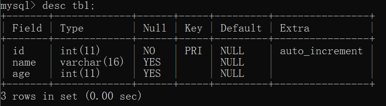
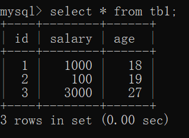
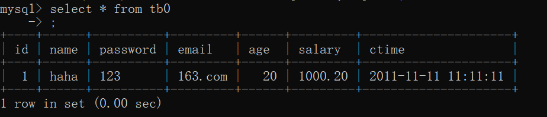

## 4 数据库管理

#### 0 总结

| MySQL  |        认知         |
| :----: | :-----------------: |
| 数据库 |       文件夹        |
| 数据表 | 文件(类似excel文件) |


  

#### 1 数据库（文件夹）管理

##### 1 查看已有数据库

```cmd
show databases;
```


##### 2 创建数据库

```cmd
create database 数据库名字(尽量用英文) DEFAULT CHARSET utf8 COLLATE utf8_general_ci;
```


##### 3 删除数据库

```cmd
drop database 数据库名字;
```


##### 4 进入数据库

```cmd
use 数据库名字;
```


##### 5 查看数据库里的所有文件

要先进入数据库

```cmd
show tables;
```


#### 2 数据表（excel文件）管理

##### 1 创建表

- 基础版

    ```cmd
    create table 表名称(
        列名称 类型,
        列名称 类型,
        列名称 类型
    )default charset=utf8;
    
    eg: 
    create table tb1(
        id int, 
        name varchar(16), 
        age int
    ) default charset=utf8;
    ```

- 扩展版

  ```cmd
  create table tb1(
      id int, 
      name varchar(16) not null,       -- 不允许为空
      age int null                     -- 允许为空
  ) default charset=utf8;
  ```

- 默认值

  ```cmd
  create table tb1(
      id int, 
      name varchar(16),       
      age int default  3       -- 默认为3
  ) default charset=utf8;
  ```

- 主键（多用于表示编号）

  ```cmd
  create table tb1(
      id int primary key,          -- 设为主键（不允许为空，不允许重复）
      name varchar(16),       
      age int
  ) default charset=utf8;
  ```

- 自增

  ```cmd
  create table tb1(
      id int auto_increment primary key,
      name varchar(16),       
      age int
  ) default charset=utf8;
  ```


##### 2 删除表

```cmd
drop table 表名称;
```


##### 3 显示表信息

```cmd
desc 表名;
```




##### 4 常用数据类型（int）

- tinyint

  ```
  tinyint           有符号 范围： -128 ~ 127 【默认】
  tinyint unsigned  无符号 范围： 0 ~ 255
  ```

  

- int

  ```
  tinyint           有符号 范围： -2147483648 ~ 2147483647 【默认】
  tinyint unsigned  无符号 范围： 0 ~ 4294967295
  ```

  

- bigint

  ```
  tinyint           有符号 范围： 非常大
  tinyint unsigned  无符号 范围： 非常大
  ```


##### 5 插入数据

id是主键且会自增，不用改变

```cmd
create table tb1(
    id int auto_increment primary key,
   salary int,       
    age int
) default charset=utf8;

insert into 表名(salary,age) values(1000,18);
```


##### 6 批量插入

```cmd
insert into 表名(salary,age) values(1000,18),(2000,18);
```


##### 7 查看表中数据

```cmd
select * from 表名;
```




##### 8 小数相关数据

- float

- double

- decimal（最为精准）

  **decimal(m,n)     -- `m`是数字总个数（符号不算），`n`是小数点后数字个数，`m`最大值为65，`n`最大值为30**

  ```vmd
  create table tb1(
      id int auto_increment primary key,
      salary decimal(8,2)                //总共是8位，小数点之后是2位
  ) default charset=utf8;
  ```

  

##### 9 字符串类型

- char（查询速度快）

  - 至多255个字符

  - 用于`加密后的密码`，`手机号`等长度固定过的东西

  - 定长字符串（一定会用n个字符来存储）

    ```cmd
    char(n)
    ```

    

- varchar

  - 最大655个`字节`(bit)

  - 变长字符串（真实数据有多长就按多长来存储）

    ```cmd
    varchar(n)
    ```

    

- text

  - 最多可容纳65535个`字符`

    ```cmd
    content text
    ```

    

- mediumtext（不常用）

  - 最多可容纳16777215个`字符`

- longtext（不常用）

  - 最多可容纳4294967295个`字符`


##### 10 时间变量

- datetime

  ```cmd
  YYYY-MM-DD HH:MM:SS (1000-01-01 00:00:00/9999-12-31 23:59:59)
  ```

- date

  ```cmd
  YYYY-MM-DD (1000-01-01/9999-12-31)
  ```


##### 11 应用-创建用户表

ctime -- create time

```sql
create table tb0(
    id int auto_increment primary key,
    name varchar(64) not null,
    password char(64) not null,
    email char(64) not null,
    age tinyint,
    salary decimal(10,2),
    ctime datetime
) default charset=utf8;

insert into tb0(name,password,email,age,salary,ctime) values("haha","123","163.com",20,1000.20,"2011-11-11 11:11:11");

select * from tb0;
```




#### 3 数据行操作

##### 1 新增数据

```cmd
insert into 表名(列名，列名，列名) values(值，值，值);
```

```sql
insert into tb0(name,password,email,age,salary,ctime) values("haha","123","163.com",20,1000.20,"2011-11-11 11:11:11");
```


##### 2 删除数据

```cmd
delete from 表名;                      -- 这是全删了
delete from 表名 where 条件;            -- 这是指定删
```

例子：

```cmd
delete from tb0 where id = 3;                       -- 这是指定id为3的数据
delete from tb0 where name = "ha" and id = 3;       -- 这是指定id为3并且name为"ha"的数据
delete from tb0 where name = "ha" or id = 3;        -- 这是指定id为3或name为"ha"的数据
delete from tb0 where id > 3;                       -- 这是指定id大于3的数据
delete from tb0 where id != 3;                      -- 这是指定id不等于3的数据
delete from tb0 where id in (1,5);                  -- 这是指定id为1~5的数据
```


##### 3 修改数据

```cmd
update 表名 set 列 = 值;
update 表名 set 列 = 值,列 = 值;
update 表名 set 列 = 值 where 条件;
```

例子：

```cmd
update tb0 set password = "哈哈哈";
update tb0 set email = "123" where id > 5;
update tb0 set age = age + 10 where id > 5;
```


##### 4 查询数据

```cmd
select * from 表名;
select 列名称,列名称 from 表名;

select 列名称,列名称 from 表名 where 条件;
```

例子：

```cmd
select * from 表名;
select id, name from tb0;

select id, name from tb0 where id > 3 and password="xx";
```